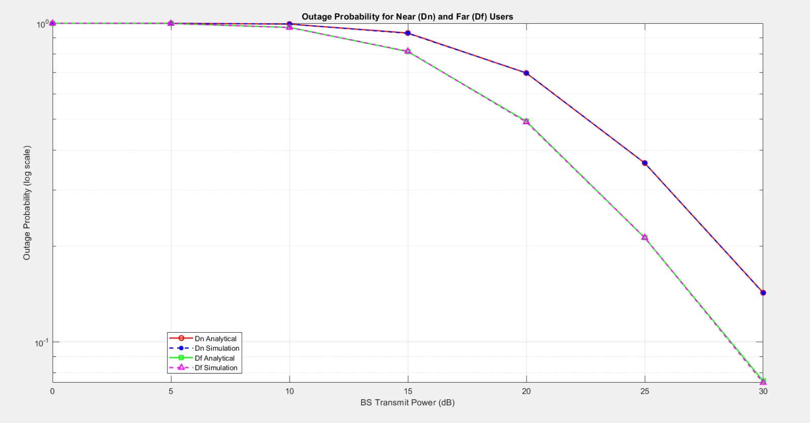
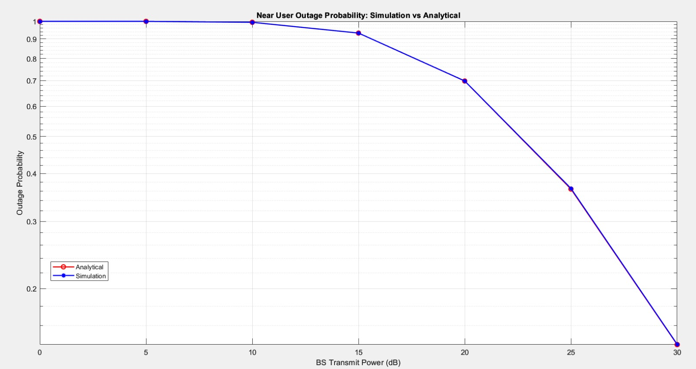
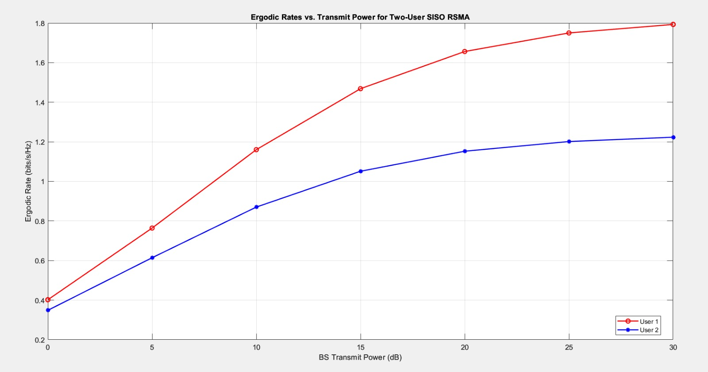
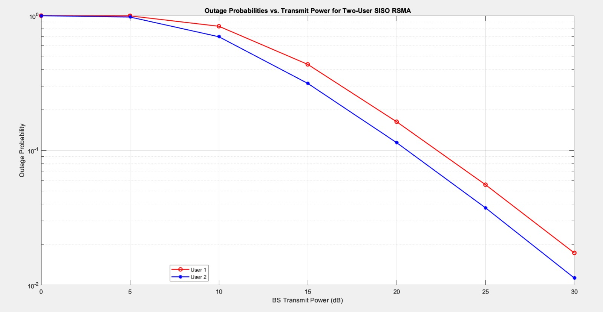

  <h1>📡 Advanced Wireless Access Simulation — NOMA & RSMA</h1>
  
<b>Course:</b> EE632: Advanced Topics in Communication Systems (IIT Guwahati, 2025)

  

    
    
    
  

<h2>🧭 Overview</h2>

This project implements <b>Monte Carlo simulations in MATLAB</b> for two modern multiple-access techniques:
<b>NOMA</b> (uplink/downlink users under interference) and <b>RSMA</b> (downlink SISO, two users).
Deliverables include <b>analytical outage probability (OP)</b> derivation/verification for NOMA and
<b>ergodic-rate / outage</b> analysis for RSMA as a function of transmit power, following the EE632 Assignment-2 brief. :contentReference[oaicite:0]{index=0}

<h2>📚 Theory (Short)</h2>
<h3>NOMA (Non-Orthogonal Multiple Access)</h3>
<ul>
  <li>Users share time/frequency resources via power-domain multiplexing; receivers use SIC / decoding order.</li>
  <li><b>Near vs Far user:</b> “Near” has stronger channel (lower path loss); “Far” has weaker channel. OP is the probability that user’s SINR falls below threshold.</li>
  <li>Tasks: derive closed-form <b>near-user OP</b>; validate via simulation; compare far-user OP simulation vs analytical curve. :contentReference[oaicite:1]{index=1}</li>
</ul>

<h3>RSMA (Rate-Splitting Multiple Access)</h3>
<ul>
  <li>Transmitter splits messages into a <b>common</b> stream + <b>private</b> streams; users decode common first, then their private part.</li>
  <li>SISO downlink with two users (D1, D2); evaluate <b>ergodic rates</b> and <b>outage</b> across transmit powers using SINR expressions. :contentReference[oaicite:2]{index=2}</li>
</ul>

<h2>✨ Features / Deliverables</h2>
<ul>
  <li><b>NOMA:</b> Closed-form near-user OP (analytic) + Monte Carlo OP for near/far users; joint plot vs transmit power.</li>
  <li><b>RSMA:</b> Monte Carlo <b>ergodic rates</b> of D1 & D2; <b>outage probabilities</b> of D1 & D2; plots vs transmit power.</li>
  <li>Reproducible MATLAB scripts and saved <code>.fig</code> (and optional <code>.png</code>) figures. :contentReference[oaicite:3]{index=3}</li>
</ul>

<h2>🧪 Assumptions (from Assignment)</h2>
<ul>
  <li><b>Channels:</b> h₁ ~ 𝒞𝒩(0, 1), h₂ ~ 𝒞𝒩(0, 1.5); noise variance = 1. :contentReference[oaicite:4]{index=4}</li>
  <li><b>RSMA powers:</b> common s_c = 0.5, private s_p,1 = 0.3, s_p,2 = 0.2; E[|s_i|²]=1; i ∈ {c,(p,1),(p,2)}. :contentReference[oaicite:5]{index=5}</li>
  <li><b>Thresholds:</b> γ_th,common at D1/D2 = 0.9; γ_th,private at D1/D2 = 0.5. :contentReference[oaicite:6]{index=6}</li>
  <li><b>NOMA:</b> Two uplink & two downlink users; interference considered; far-user OP expression given in class (compare with sim). :contentReference[oaicite:7]{index=7}</li>
</ul>

<h2>🗂️ Repo Structure (suggested)</h2>
<pre>
/src
  noma_near_op_analytic.m          % closed-form near-user OP (function + demo)
  noma_op_simulation.m             % MC OP for near & far users + comparison plot
  rsma_rates_outage_sim.m          % MC ergodic rates & outage for D1/D2
/figs
  noma_outage_vs_power.fig/png
  rsma_rates_vs_power.fig/png
  rsma_outage_vs_power.fig/png
README.md
</pre>

<h2>▶️ How to Run (MATLAB)</h2>
<ol>
  <li>Open <code>/src</code> in MATLAB.</li>
  <li>Run <code>noma_near_op_analytic.m</code> to generate the near-user analytic OP curve.</li>
  <li>Run <code>noma_op_simulation.m</code> to simulate near/far OP and save plots in <code>/figs</code>.</li>
  <li>Run <code>rsma_rates_outage_sim.m</code> to compute RSMA ergodic rates & outages; plots saved in <code>/figs</code>.</li>
</ol>

<h2>📊 Expected Results (placeholders)</h2>
<ul>
  <li><b>NOMA:</b> OP vs transmit power with <i>near (sim vs analytic)</i> and <i>far (sim vs class analytic)</i> on one figure.</li>
  <li><b>RSMA:</b> (i) Ergodic rates of D1 & D2 in one plot; (ii) Outage probabilities of D1 & D2 in one plot.</li>
</ul>

<ul>

  

  

  

  

  

</ul>

<h2>✅ Requirements</h2>
<ul>
  <li>MATLAB (R202x+). Useful functions: <code>rand, randn, randi, mean, var, qfunc, semilogy, subplot, hist, stem, abs</code>. :contentReference[oaicite:8]{index=8}</li>
</ul>

<h2>🧩 Notes</h2>
<ul>
  <li>Use the assignment’s SINR thresholds, power splits, and channel models exactly for fair comparison. :contentReference[oaicite:9]{index=9}</li>
  <li>Save <code>.fig</code> as required and include <code>.m</code> scripts with figures for submission. :contentReference[oaicite:10]{index=10}</li>
</ul>

